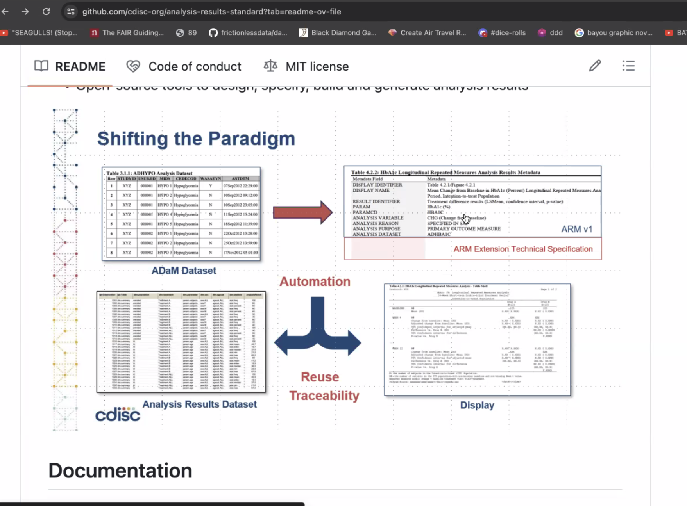

## Minutes RTRS WG Meeting January 11, 2023

Minutes by Joseph Rickert

### Attendees

* Gabriel Becker
* David Gohel
* James Kim - Pfizer
* Joseph B Rickert - ProCogia
* Adrian Waddell - Roche

The meeting was recorded and the [video](https://zoom.us/rec/share/fPRuc_IYPbpAwXLs1FkrIzr31QQZLrhkFrofIHHSYjGU7GJP27JlPzY3c6lz_9Zz.Ahe3pfsbLb3v0xHJ?startTime=1704992541000) is available.

### ebook update

* Adrian walked through the new section of the document that he has begun writings "Tables, Listings, and Graphs at Scale".
* The section considers scale with respect to four dimensions:
 * The number of tables that may be required
 * The size of the tables themselves potentially spanning multiple pages
 * The number of people who may be collaborating on a project
 * The number of coherence and cross-checks that may be required to ensure quality
* The discussion on collaboration also considered how table templates are encoded and transmitted to various members of the study team. The automating this process alleviates some of the technical burden on the members of the study team.
* There was also a discussion on the the relevance of the CDISC [ARS](https://github.com/cdisc-org/analysis-results-standard), Analysis and Results standard. Gabe's impression is that the ARS is more concerned with checking after the table has been constructed and is related to coherence and cross-checking. 
* At 26:50 in the video there is a discussion of the following figure from the ARS documentation. It seems to indicate that the ARS file is an alternate display of the data that is in a form for program manipulation.

* The discussion on the scope of this work and what we can accomplish will continue at our next meeting.
* The general sentiment is that even if we cannot discus write about TLG scale in depth, it is important to identify the problems and articulate the issues.
* It was also suggested that we continue with refinement of what we have already written including the Listings chapter.

## useR!2024

The group agreed that we should submit a paper for useR!

## Next Meeting
 The next meeting of the working group will be a 9AM Pacific Time on Thursday, February 1, 2024.
