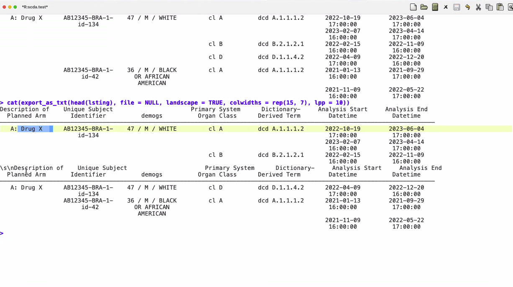

## Minutes RTRS WG Meeting June 6, 2024

Minutes by Joseph Rickert

### Attendees

* Gabe Becker
* Joseph B Rickert

### Listings

Gabe added sections 5.0 and 5.1 toe the dev version of the document. 5.0 is a brief introduction to listings and 5.1 contains the code and output for a simple listing.

Gabe needs to update an rtabes() function before committing the changes to the development version of the document. He expects to complete this within the week.

### Next Steps

Adrian Waddell is committed to writing the next steps section of the dev document within the next couple of weeks

Using Gabe's listings code as a model, we invite the other package contributors to update their respective sections of the document

### Next Meeting

We will cancel the July meeting which is scheduled for July 4, 2024 and meet again at 9AM on August 1, 2024
