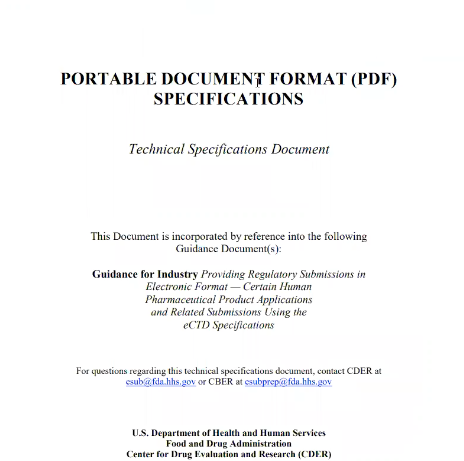
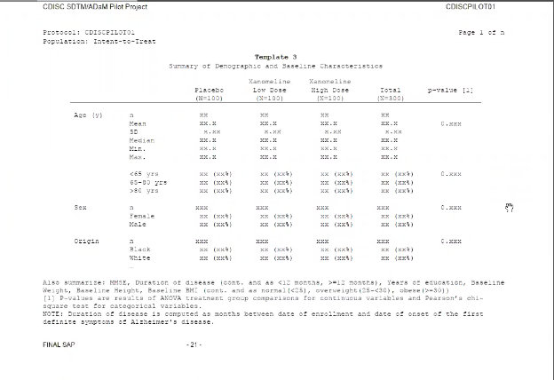
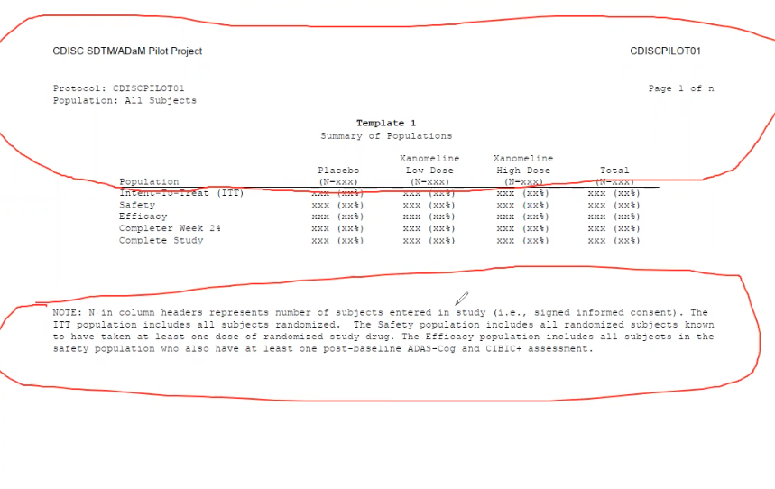

## R Tables for Regulatory Submissions Working Group

Minutes for 3/4/2021 meeting prepared by Rich Ianonne and Joseph Rickert

## Attendees
* Kevin Bolger - Procogia
* Bryant Chen - FDA
* Rich Iannone - RStudio
* Michael Kane - Yale
* Nathan Kosiba - Atorus Research
* Ning Leng - Roche
* Nicholas Masel - J&J
* Eli Miller - Atorus Research
* Himanshu Pandya - Biogen 
* Joseph Rickert - RStudio -
* Michael Stackhouse - Atorus Research
* Ben Straub - GSK 
* Yilong Zhang - Merck
 

Joe Rickert began the meeting and suggested we begin with three topics from last month's meeting:
* Finishing the requirements document
* Inter-company collaboration on coding tables
* Mapping out company workflows for table generation

(Times given in bold are referenced to the zoom video recording.)
**1:31** Mike Stackhouse initiates discussion on Workflows

**3:19** Tables should be generated from [ADaM](https://www.cdisc.org/standards/foundational/adam) data sets not from Case Reports

Mike Stackhouse posited that the ideal workflow for regulatory table generation is SDTM -> ADaM -> TFLs (in SAS language, ADaM should be one proc away from TFL)

**7:30**  Discussion on output requirements

R developers should provide tools that can be utilized in a metadata driven system (companies may draw from the tools as needed)

**10:05** Joe R asks what is first step towards demonstrating tangible progress towards meeting requirements. Yilong Zhang points out first step has already been taken with the CDISC pilot. Mike S suggest there should be some compare and contrast

**10:50**  Nick Masel talks about requirements list being developed at J&J
Nick is willing to share if he gets permission

**11:25** Yilong Zhang offers that Merck requirements are implemented in the [r2rtf](https://cran.r-project.org/package=r2rtf) package

Those present agree that every company will have their standards for tables and their own version of a requirements document.

**12:45** Kevin Bolger brings discussion to FDA requirements

**14:48** discussion of FDA recommendations for the tabular reporting (font and font size) and this in a publicly-accessible document. Bryant Chen mentions that FDA has internal guidelines for doing reviews that cannot be shared with industry.

**15:42** Yilong shares screen showing FDA document. 

Bryant emphasizes that the document offers non-binding recommendations. FDA will not reject a submission because of failure to meet non-binding suggestion.

**17:32** Mike S. outlines table generation workflow. Tables are prepared by statistical programmers -> handed over to medical writing teams -> medical writing aggregates information into submission document

**20:00** Bryant describes how requirements may be interpreted differently within FDA. Suggests programs to generate tables more important than looking for standards. There aren't hard and fast standards on appearance for tables according to the FDA, the statistical content is more scrutinized.

**23:30** Ning Leng notes work of this group will have more impact on smaller companies than large companies which already have internal standards and workflows. Kevin notes that for smaller companies if it is difficult to do a submission in R they will just default to not using it.

**25:33** discussion returns to workflows. Mike Kane asks what else in addition to ADaM is required to generate tables. Mike S notes that in most cases the statisticians will generate mocks of what the tables should look like. A common practice in companies is to use ADAM datasets and have mock layouts of common data tables (i.e., archetypes for reporting tables). The mock tables will have headers and footers with the necessary content templated. The CDISC pilot has an example of this. The mock tables can often be quite detailed blueprints of the intended reporting tables. Nick Masel notes that sometimes statisticians will take mock tables and annotate them to link the data to the table.

**28:25** Nick Masel shares screen to show example of a mock table.

Sometimes annotations indicate data sets and variables to use to fill in the table.

**30:30** Mike Kane notes that a mock table is different than a theme for a table and asks if packages for creating tables have a mock table function. Nick note J&J has an internal application for buildings. Rich Iannone states that he has thought about creating such a function for the `gt` package. But that `gt` and other table making packages should have some tools for templates.

**35:35** Mike Stackhouse shares screen with mock table from the CDISC pilot. Mike notes that he has posted the CDISC pilot into the RTRS WG repo. 

This table came from page 435 of the CDISC document

**36:50** Mike initiates discussion on table packages and gap analysis and suggest this is the next step for the group. Rich notes it would be helpful to have some issues opened for table-making packages. It would be helpful to know if there are serious shortcomings for RTF table generation. The `gt` package has had developments in RTF (in master) and some trialing of its new capabilities + feedback would be appreciated.

Yilong asks if `gt` can generate mock table. Rich notes that some things missing such as alignment. However, Mike suggests that decimal alignment is not done today. (SAS doesn't do it.)

**42:10** some discussion about completeness of `gt` with respect to rtf formatting. Mike Stackhouse offers to test `gt` capabilities.

Mike Stackhouse notes that he wants to overhaul `pharmaRTF` to estimate page size from fonts and rows and suggests that this will be difficult and might best be handled as an industry effort.

Reporting tables across pages is a significant challenge but it would be useful to have table making packages divide/chunk table content efficiently across pages.

**45:48** A discussion begins about headers and footers.  Mike notes that over the past year several users have requested that `pharmaRTF` be able to move headers and footers into the body of the table and just not use headers and footers. Mike shares his screen to illustrate problem.

Yilong offers to try to reproduce example using `r2rtf`

**50:30** Nick shares screen to show example of table where title within body and repeats but footnotes only shown once.

**51:14** Yilong shares screen to shows example of repeating headers and footnotes only at the end.

The group discusses sharing code to implement these features in `pharmeRTF` and `gt`.

**53:02** Mike Kane suggest that we should see what it takes to generate the CDISC example. He wants to pin down all of the information required.
Rich concurs that a fully worked example from CDISC data would be useful in the RTRS GitHub repository. This would help surface issues in table-making packages.

**56:00** The next meeting was scheduled for May 6, 2021 9:00AM Pacific and Joe Rickert asks people to use the repo to share work and document results.

Here is the zoom link to the video of the meeting:
https://zoom.us/rec/share/AB7KlFnrU77u6mF-GjbExlhgffDgucSgufogrimfEbP8KfXK0Kx6W4qjZGA0Y_sj.e96dgSJ0C9c_c12h Passcode: !NC4U033

