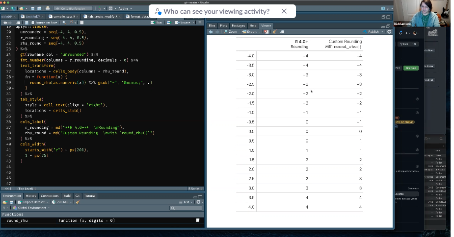

Minutes compiled by Joseph Rickert

### Attendees

* Kevin Bolger - Procogia
* Rich Iannone - RStudio
* Michael Kane - Yale
* Nathan Kosiba - Atorus Research
* Eli Miller - Atorus Research
* Joseph Rickert - RStudio 
* Adrian Waddell - Roche
* Yilong Zhang - Merck

Joe brought the meeting to order at 9:03 and began recording.
Rich Ianonne provided examples of Rounding issues

He showed an example of Rv4.1 rounding to even which is different from Excel and SAS. It is also different from what R versions earlier than Rv4.0 would do. The right column in the following screen capture recreated the rounding behavior of Rv3.6 or lower. The left column shows haw Rv4.0 rounds.

This is expected to be a minor issue in practice, but needs to be documented.

Immediately after the meeting Rich opened up [issue 9](https://github.com/RConsortium/rtrs-wg/issues/9) in the RTRS repository summarizing his presentation.

Next followed an extended discussion about desirable features, metadata for tables, and the complexity introduced.

The group next discussed use cases and a TLG Catalogue of standard tables. It was noted that Phuse put out a catalogue of standard tables. For examples 
see [Analyses and Displays Associated with Demographics, Disposition and Medications](https://phuse.s3.eu-central-1.amazonaws.com/Deliverables/Standard+Analyses+and+Code+Sharing/Analyses+%26+Displays+Associated+with+Demographics,+Disposition+and+Medication+in+Phase+2-4+Clinical+Trials+and+Integrated+Summary+Documents.pdf).

The group decided that examples of the various tables should be included in the TLG catalogue which is envisioned as an online bookdown book.

### Action Items  

* Joe will set up an R Consortium GitHub repo.

* Eli will provide examples of tables.

* Adrian will present the Tables in Pharma Data Tabulation paper he is writing at the next meeting. (Note this is envisioned as one in a series of papers.).

It was agreed that the next meeting was to be on Thursday July 1, 2021 at 9AM Pacific time.

The video of the 6-3 meeting is available here: 
https://zoom.us/rec/share/wh9y0jS54521NrCysnJzebBVRz3oZiKEeM3vnFPzS37TpL1DmQgeuBgIFSYHwaVq.aMWiflHU2MQmmgF4 Passcode: &BvkT8tF

