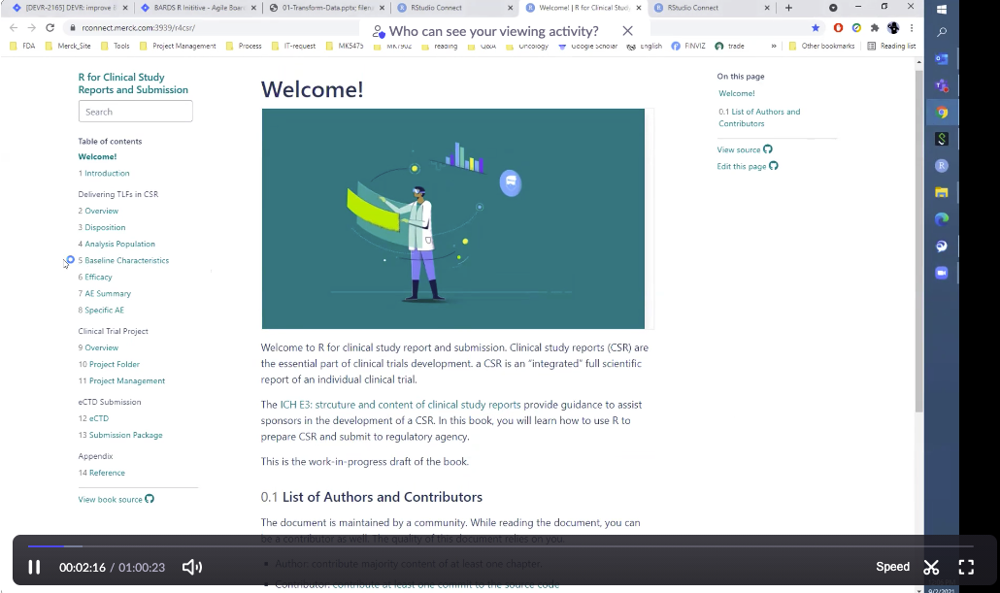
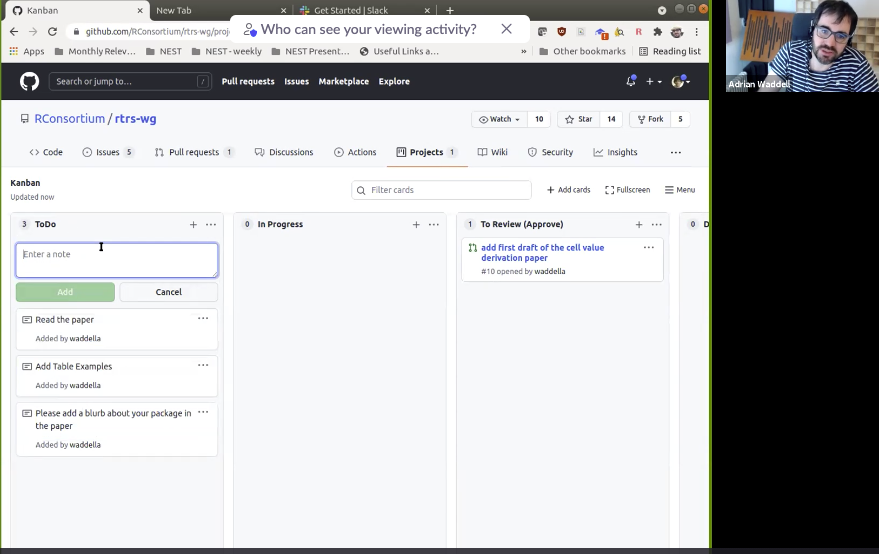

Minutes compiled by Joseph Rickert

### Attendees

* Keaven Anderson - Merck
* Gabriel Becker
* Martin Brown - PPDI
* Kevin Bolger - Procogia
* Bryant Chen - FDA
* Rich Ianonne - RStudio
* Nathan Kosiba - Atorus Research
* Tadeusz Lewandowski - Roche
* Tulasi Marrapu
* Joseph Rickert - RStudio 
* Adrian Waddell - Roche
* Yilong Zhang - Merck

Joseph Rickert brought the meeting to order at 9:04AM Pacific Time.

Yilong Zhang notified the group that he and Keaven Anderson are preparing a workshop for the R / Pharma conference that will include the work Merck is doing on tables and touch on some of the topics discussed in this working group. Yilong said that he plans to have the material on GitHub by the end of the month and invited the members of this group to comment.

Yilong gave an overview of the contents of the workshop. He noted that the examples will focus on the r2rtf package.

Yilong hopes to have up through Chapter 8 of the document shown above complete by the end of September.

Joe asked if there would be a slide in the presentation about the RTRS working group. Yilong replied "Absolutely, and said that he planned to highlight the work of the Submission and R Validation Groups also. He also said that he would appreciate additional examples from the working group, and feedback on the workshop materials. Those present said that they would be happy to do so.

Adrian and Tadeusz said that they are also preparing a presentation for the R / Pharma conference. It will be along the lines of what they are doing in the Submissions working group.

Gabe Becker (18:25 in video) brought up the distinction between cell content generation, the actual calculation that create the numbers that go into a table, versus tabulation which is the arrangement of numbers into display form. This generated considerable discussion about the importance of the distinction and related topics. Keaven asked the group to keep these issues in mind when reviewing Yilong's workshop content.

There was discussion on workflows. Adrian outlined a sequence that separated rtables work from the business logic layer and then standards and meta information. The point with respect to standards is to have functions with parameters that are required for particular standards and not overloaded with extraneous material.

Gabe then moved the discussion to consider the capture of provenance which he described as a computationally useful description of exactly how a particular artifact was derived. If you have that, you know what tables can be compared, what tables cannot even though they may have the same structure.

Joe (36:28 in the video) brought up the need to bring some organization to the project. He asked the group to decide how we should manage pull requests and stressed the need to develop procedures that would make it easy for people to contributing to writing the document and contribute examples. He also raised the possibility of the producing a CRAN Task View for tables. 

Those present like the idea of a Tables Task View  and spent some time discussing alternatives. Yilong raised the idea of including tables and graphics. Gabe outlined two possibilities:

1. Tables Task View that has all tables including those not relevant to Pharma
2. A Pharma-centric Tables Task View that might include tooling that deals with standards

Yilong suggested pursuing both.

Gabe observed that once the paper is complete, proposing a CRAN Task View should be relatively easy.

Adrian reviewed the pull request for the paper he is writing and asked that others review the work. Those present asked for write privileges Joe, who is a an admin for the project, agreed to do so.

Adrian also asked that authors of relevant packages mentioned in the paper to provide descriptions of their packages. 

Next, followed a discussion about tools for organization. The group discussed having both project management in GitHub and a slack channel. Adrian then created a Kanban board on the RTRS repo. 

He populated the project board with some high level tasks. Gabe suggested that each table package author open a *To Do* for their individual package.

The zoom video recording of the meeting is available [here](https://rstudio.zoom.us/rec/share/nduyhIBUnJwZsZrNUdSBJ4M6zkfdUMpO9HQ_3AyiCnd_4oG3QSAdLl1UpIxGx21-.Lex_84rhEIuoXKRs) Passcode: U=FTFH.8

The next RTRS working group meeting is set for Thursday, October 7 at 9:00 AM Pacific Time.

After the meeting Joe gave the following people write privileges on the RTRS GitHub repo:  

* rich-iannone
* gmbecker
* elong0527
* lewandt
* kodesiba
* mstackhouse

