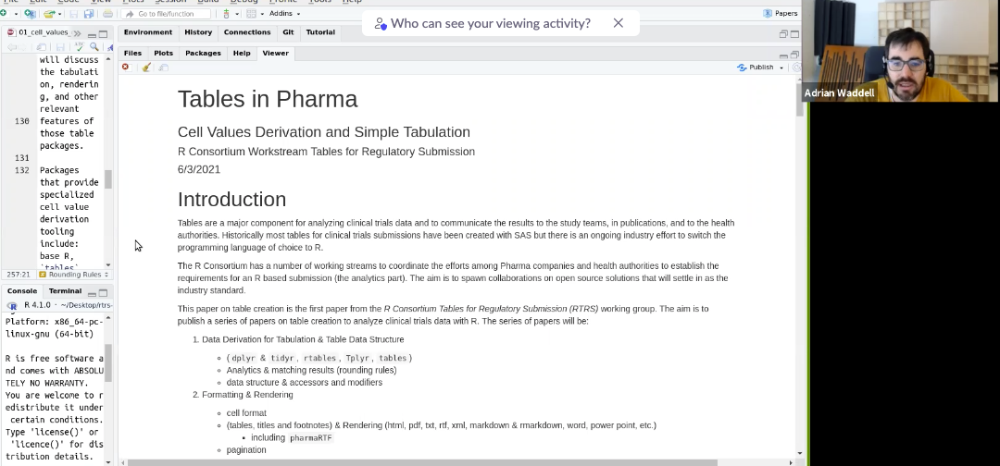

Minutes compiled by Joseph Rickert

### Attendees

* Keaven Anderson - Merck
* Gabriel Becker
* Kevin Bolger - Procogia
* Bryant Chen - FDA
* Bob Engle - Biogen
* Michael Kane - Yale
* Nathan Kosiba - Atorus Research
* Tadeusz Lewandowski - Roche
* Tulasi Marrapu - GSK
* Nicholas Masel - JnJ
* Himanshu Pandya - Biogen
* Joseph Rickert - RStudio 
* Michael Stackhouse - Atorus
* Adrian Waddell - Roche
* Yilong Zhang - Merck

Joseph Rickert brought the meeting to order at 9:03AM Pacific Time.

Adrian Waddell began walking the group through the his recent additions to the "Tables in Pharma" paper that the WG is working on as pull request in the RTRS repository. 

Adrian described how we are planning a series of papers and noted that we probably don't need a separate use case, but can include it in the various topics. He described how we are basically taking a survey approach.

Some topics of interest:
* creating tables at scale
* cross checking (text and tables, tables in different documents)
* listings
* patient profiles (tables or interactive displays)
* HTML extensions

Adrian asked the authors of the various R packages listed in the overview section write summaries of what their packages do.

Gabe asked about agency opinions about changing formats. Bryant Chen indicated that this would be a huge effort. 

Keaven Anderson remarked that providing new concepts could influence future guidelines Along these lines the group discussed HTML websites for tables and interactivity.

Joe pointed out that in June alone that were several new packages concerned with tables, and that some of these may be of interest to our efforts. Adrian and Gabe agreed that we should survey the R packages using tables.

New packages release to CRAN June which may be of interest are:
* [clinDataReview](https://cran.r-project.org/package=clinDataReview)
* [clinUtils](https://cran.r-project.org/package=clinUtils)
* [inTextSummaryTable](https://cran.r-project.org/package=inTextSummaryTable)
* [patientProfilesVis](https://cran.r-project.org/package=patientProfilesVis)
* [visR](https://cran.r-project.org/package=visR)

There was some discussion about whether the paper should make recommendations, especially when there are multiple ways to do the same thing. Gabe observed that survey papers do not pick winners. There was general agreement that it would be nice to include a table in the paper comparing the capabilities of the different table packages. However, we should be careful not to include features that would bias the comparison, features that are nice but not essential.

It was agreed that we should give considerable thought to selecting the sample tables. We want to explore the space of cell derivation and make sure we include examples of tables that are structurally dissimilar. Otherwise, we would essentially be showing how to make variations of the same table. For example, we should include tables that have nested splitting in the column space. We should include one example from each plausibly  useful different table structure.

It was decided to just merge additions to the document and not go through the formal process of pull requests.

Note: The PhD Thesis [Tabular Abstraction, Editing, and Formatting](https://uwspace.uwaterloo.ca/bitstream/handle/10012/10962/WANG_XINXIN_.pdf?sequence=1&isAllowed=y) by Xinxin Wang is recommended reading.

The [zoom recording](https://rstudio.zoom.us/rec/share/t0fUfIa_5cOnpvnfnEztB6THNA17Quhm2ZqBl6sqYW5nAPoBZLj7S8fkNR1XYxc.KDdbnZWyPcgcMN6O) of the meeting is available (Passcode: @9hz#0ih).

The next meeting of the WG will be at 9:00AM Pacific Time on Thursday, September 2, 2021.

