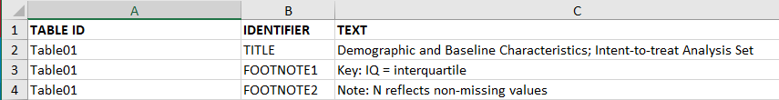
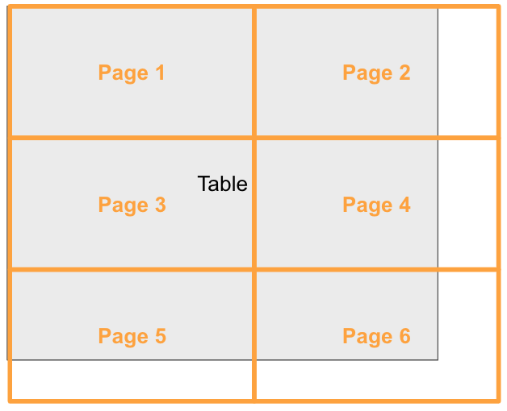

# Formatting and Rendering Tables

Table generation usually is a two step process

1. Derive the cell value and tabulate them.
1. Create the final table output, save it to a file to be shared with collaborators. 

Chapter [Commonly Used Tables] focuses on the work involved in step 1.  In this chapter we
discuss the various aspects of creating the final output that is commonly stored
in a file with a particular file format (`pdf`, `txt`, `html`, `docx` or `rtf`).

## Title & Footnotes

Commonly rendered tables that are reported to the health authorities have titles
and footnotes with information such as:

- what is summarized in the table
- database lock date
- patient sub-population
- notes by study team
- notes regarding statistical algorithms chosen
- provenance information including path to program and when the table was created

Often footnotes include cell references.

### gt

The *gt* package lets you add a title and even a subtitle and *preheader* lines (for RTF) with its `tab_header()` function. In the following example, we create some `sample_data` and feed that into the `gt()` function. We can automatically create a table stub (for row labels) and row groups with the `rowname_col` and `groupname_col` arguments of `gt()`.

```{r}
resetSession()
library(gt)

sample_data <-
  dplyr::tibble(
    label = c("n", "Mean (SD)", "Median", "Min - Max", "F", "M", "U", "UNDIFFERENTIATED"),
    `val_A: Drug X` = c(134, 33.8, 33, NA, 79, 51, 3, 1),
    `val_B: Placebo` = c(134, 35.4, 35, NA, 77, 55, 2, 0),
    `val_C: Combination` = c(132, 35.4, 35, NA, 66, 60, 4, 2),
    category = c(rep("Age (Years)", 4), rep("Sex, n (%)", 4))
  )

gt_tbl <-
  gt(
    sample_data, 
    rowname_col = "label",
    groupname_col = "category"
  ) |>
  tab_header(
    title = "x.x: Study Subject Data",
    subtitle = md(
      "x.x.x: Demographic Characteristics  \n Table x.x.x.x: Demographic
      Characteristics - Full Analysis Set"
    ),
    preheader = c("Protocol: XXXXX", "Cutoff date: DDMMYYYY")
  ) |> 
  tab_source_note("Source: ADSL DDMMYYYY hh:mm; Listing x.xx; SDTM package: DDMMYYYY") |> 
  sub_missing(missing_text = "") |> 
  tab_options(
    page.orientation = "landscape",
    page.numbering = TRUE,
    page.header.use_tbl_headings = TRUE,
    page.footer.use_tbl_notes = TRUE
  )

gt_tbl
```

The above example contains the use of the `tab_source_note()` function. You can create as many source notes in the table footer as you need, and they typically describe the data table as whole (i.e., not pointing to anything specific). For that, you can use footnotes and target cells that require additional explanation. Here's an example of that using `tab_footnote()`:

```{r}
gt_tbl |>
  tab_footnote(
    footnote = "This is the combination of the two.",
    locations = cells_column_labels(columns = `val_C: Combination`)
  ) |>
  tab_footnote(
    footnote = "These values are the same.",
    locations = cells_body(
      columns = matches("_A|_B"), rows = "n"
      )
  )
```

The `tab_footnote()` function allows for footnotes to be placed anywhere in the table (using the `cells_*()` helper functions for targeting). Targeting `columns`, `rows`, or other locations can be done with Tidyselect-style helper functions, ID values, or indices.

As a final note on the first example, we can specify certain `page.*` options that make RTF output ideal for regulatory filing purposes. The options employed above in the `tab_options()` call ensure that pages are in landscape orientation, page numbering for each table is activated, and that page header and footer are used for the table's headings and footer elements.

### rtables

The `basic_table()` function in *rtables* has the arguments `titles`, `subtitles`,
`main_footer`, `prov_footer` to add titles and footnotes to tables. *rtables*
also supports referential footnotes.

So for example a basic demographics table created with *rtables* via *tern* with
title and footnotes would look as follows:

```{r, comment=NA }
resetSession()
library(rtables)

lyt <- basic_table(
  title = "Demographic Table - All Patients",
  subtitles = c("Cutoff Date: June 01, 2022", "Arm B received a placebo."),
  main_footer = c("Missing data is omitted.")
) |>
  split_cols_by("ARM") |>
  analyze(c("AGE", "SEX"))

build_table(lyt, adsl)
```

### flextable

Titles and notes can be added and formatted with the *flextable* package. It is possible to add them in the header and in the footer. Several methods are possible but for most needs, the `add_header_lines()` and `add_footer_lines()` functions will be the easiest to use.

Let's create first a flextable from an aggregation that 
will be used to illustrate the features.

```{r message=FALSE}
resetSession()
library(flextable)
library(dplyr)

z <- adsl |> 
  group_by(ARM, SEX) |>
  summarise(avg = mean(AGE), sd = sd(AGE)) |>
  tabulator(rows = "SEX", columns = "ARM",
    Y = as_paragraph(avg, " (", sd, ")")) |> 
  as_flextable()
z
```

The following shows how to add titles or notes:

```{r}
z |>
  add_header_lines("hello world") |>
  add_footer_lines("bye bye world")
```

For Word output, users can prepend a table number that will auto-incremente.

```{r}
docx_file <- "reports/flextable-title-01.docx"
ft <- add_header_lines(z, "hello world") |>
  prepend_chunks(
    i = 1, j = 1, part = "header", 
    as_chunk("Table "), as_word_field("SEQ tab \u005C* Arabic"), 
    as_chunk(": ")) |>
  add_footer_lines("bye bye world") |>
  theme_vanilla()
save_as_docx(ft, ft, path = docx_file)
```


```{r echo=FALSE, link_preview=TRUE, path_to_doc = "reports/flextable-title-01.docx"}
```

Footnotes are also available in *flextable* with function `footnote()`. 
The function lets users add footnotes and references to it on the table.


```{r}
footnote(z, i = c(1, 2, 2), j = c(1, 5, 7), 
         value = as_paragraph("hello world"), ref_symbols = "(1)")
```

### tfrmt

The `tfrmt()` function in the *tfrmt* package includes the arguments `title` and
`subtitle` to add titles. Within the `footnote_plan()` function, the user can nest 
multiple `footnote_structure`s to add footnotes with superscript reference 
symbols on groups, columns or labels.

To demonstrate, this example will create a mock demographics table:

```{r}
resetSession()
library(tfrmt)
library(dplyr)
library(tidyr)

# Create mock data
df <- crossing(group = c("AGE", "SEX"),
               label = c("label 1", "label 2"),
               column = c("Drug X", "Placebo", "Combination"),
               param = c("count", "percent"))

# Create specification
tfrmt_spec <- tfrmt(
  # Add titles
  title = "Demographic Table - All Patients",
  subtitle = "Cutoff Date: June 01, 2022. Arm B received a placebo.",

  # Specify table features
  group = group,
  label = label,
  column = column,
  param = param,
  row_grp_plan = row_grp_plan(
    row_grp_structure(group_val = ".default",
                      element_block(post_space = "   ")) ),

  # Define cell formatting
  body_plan = body_plan(
    frmt_structure(group_val = ".default", label_val = ".default",
                   frmt_combine("{count} ({percent})",
                                count = frmt("xx"),
                                percent = frmt("xx.x")))),

  # Add footnotes here
  footnote_plan = footnote_plan(
    footnote_structure(footnote_text = "Footnote about column", column_val = "Combination"),
    footnote_structure(footnote_text = "Footnote about group", group_val = "AGE"),
    marks = "numbers"),

)

print_mock_gt(tfrmt_spec, df)
```

See this vignette for more details on footnotes: [link to website](https://gsk-biostatistics.github.io/tfrmt/articles/footnotes.html)


### tables

The *tables* package concentrates on the table itself.  The titles
are generally written as part of the surrounding document.  Footnotes
would be added after constructing the table by modifying 
individual entries.

Alternatively for HTML output, only the footnote
markers need to be added by modifying entries, and then
the footnotes can be applied by using `toHTML(tab, options = list(doFooter = TRUE, 
HTMLfooter = HTMLfootnotes(...))`.

```{r}
resetSession()
adsl <- cadsl

library(tables)
table_options(doCSS = TRUE)

sd_in_parens <- function(x) sprintf("(%.1f)", sd(x))

tab <- tabular(SEX ~ Heading()*ARM*
                     Heading()*AGE*
                     Heading()*(mean + sd_in_parens), 
               data = adsl)

rowLabels(tab)[1,1] <- paste(rowLabels(tab)[1,1], "<sup>a</sup>")
tab[2,2] <- sprintf("%s%s", tab[2,2], "<sup>b</sup>")
tab[2,3] <- sprintf("%.2f%s", tab[2,3], "<sup>b</sup>")

footnotes <- HTMLfootnotes(tab, a = "This is a label footnote.",
                                b = "These are cell footnotes.")
toHTML(tab, options = list(HTMLfooter = footnotes,
                           doFooter = TRUE))
```

### tidytlg

The `gentlg()` function in the *tidytlg* package includes the `title` argument for 
adding title and the `footers` argument for adding footnotes to the table output. 
Users can include a vector of character strings for multiple lines of footnotes 
(please see an example below). At the bottom line of the footnotes, the file name 
of the table and the path of the table program along with the datetime stamp are automatically created.

```{r, warning=FALSE}
resetSession()
library(dplyr)
library(tidytlg)

adsl <- formatters::ex_adsl 

# create analysis set row
t1 <- freq(adsl,
           rowvar = "ITTFL",
           colvar = "ARM",
           statlist = statlist("n"),
           subset = ITTFL == "Y",
           rowtext = "Analysis set: ITT") 

# create univariate stats for age
t2 <- univar(adsl,
               rowvar = "AGE",
               colvar = "ARM",
               statlist = statlist(c("N", "MEANSD", "MEDIAN", "RANGE", "IQRANGE")),
               row_header = "Age (years)",
               decimal = 0)

tbl <- bind_table(t1, t2)

# assign table id
tblid <- "Table01"

# output the analysis results
gentlg(huxme       = tbl,
       format      = "HTML",
       print.hux = FALSE,
       file        = tblid,
       orientation = "portrait",
       title = "Demographic and Baseline Characteristics; Intent-to-treat Analysis Set",
       footers = c("Key: IQ = Interquartile","Note: N reflects non-missing values"),
       colheader = c("","A: Drug X","B: Placebo","C: Combination"))

```

To programmatically incorporate titles and footnotes into each table program, users can create an excel file called `titles.xls` (see below snapshot) with the columns of `"TABLE ID","IDENTIFIER","TEXT"`. In the `gentlg()` function call, users just need to provide the argument of `title_file` for specifying the location of `titles.xls`. Then the title and footnotes corresponding to the table ID will be automatically included in the table output. Users need to make sure the correct table ID is used for the `file` argument of the `gentlg()` function call.

```{r, echo=FALSE, out.width = "600px"}

```

```{r, eval=FALSE}
gentlg(huxme       = tbl,
       format      = "HTML",
       print.hux = FALSE,
       file        = tblid,
       orientation = "portrait",
       title_file = system.file("extdata/titles.xls", package = "tidytlg"),
       colheader = c("","A: Drug X","B: Placebo","C: Combination"))
```

## Captions

A caption is a single paragraph of text describing the table. 
Captions are often used because they allow you to
cross-reference tables or list them in a 'list of tables' with the corresponding
page numbers.

### flextable

The `set_caption()` function in *flextable* is the recommended way to add
captions. 

```{r}
resetSession()
library(flextable)

flextable(head(cars)) |>
  set_caption(
    caption = "a caption",
    autonum = officer::run_autonum(seq_id = "tab", bkm = "flextable-label"))
```

In *bookdown*, use the syntax `\@ref(tab:flextable-label)` to create a linked 
reference to the table. Here is an example of a reference: \@ref(tab:flextable-label).

With `Quarto`, the R chunk code should be transformed as: 

````r
#| label: tbl-flextable-label
#| tbl-cap: a caption
flextable(head(cars))
````

### tables

As with titles, captions would be added as part of the
surrounding document rather than part of the table object.

## Pagination

Historically tables have been printed to paper for submissions. Hence large tables
that would not fit onto a single printed page (e.g. letter & portrait) would have to 
be split into multiple tables that can be printed to the preferred page size. This 
process of splitting the table is called *pagination* of tables.



Pagination of complex structured tables is complicated by the fact
that some rows of such tables require contextual information -- e.g.,
any group labels or summaries they fall under -- to be fully
understood. This means that any such context must be repeated after a
page break for that page to be understood in isolation.


### rtables

*rtables* supports context-preserving pagination in both the
horizontal and vertical directions (via the interface provided by
*formatters*) via calling `paginate_table()` directly, and within the
`export_as_*` rendering functions. Users specify page dimensions (in
either inches, or lines long and characters wide) and font information
and the pagination and export machinery paginates the table such that
each portion will fit fully on its page when rendered as text,
including title, footer, and referential footnote materials.


For vertical pagination, summary rows (whether label rows, or so-called
content rows containing summary values) are repeated after page
breaks to preserve context on the following page. We see this in action below when pagination occurs within the strtata B - ASIAN facet of the the following table

```{r}
resetSession()
library(rtables)

lyt <- basic_table(title = "main title", subtitles = "subtitle", main_footer = "main footer", prov_footer = "provenance footer") |>
  split_cols_by("ARM") |>
  split_cols_by("SEX", split_fun = keep_split_levels(c("F", "M"))) |>
  split_rows_by("STRATA1", split_fun = keep_split_levels(c("A", "B"))) |>
  split_rows_by("RACE", split_fun = keep_split_levels(c("ASIAN", "WHITE"))) |>
  summarize_row_groups() |>
  analyze("AGE", afun = function(x, ...) in_rows("mean (sd)" = rcell(c(mean(x), sd(x)), format = "xx.x (xx.x)"),
                                                 "range" = rcell(range(x), format = "xx.x - xx.x")))

tbl <- build_table(lyt, ex_adsl)
tbl
```

`paginate_table()`, then, breaks our table into subtables -- including repeated context where appropriate -- which will fit on physical pages (we use 5.2 x 3.5 inch "pages" for illustrative purposes here):

```{r}
paginate_table(tbl, pg_width = 5.2, pg_height = 3.5, min_siblings = 0)
```

*rtables* also supports *page-by splits* in its layouting framework,
which declares that -- regardless of rendering dimensions --
pagination should occur between distinct levels of a variable. Each of
these "pagination sections" have an additional title specific to the
level, and are independently paginated for dimension as needed. 

```{r}
lyt2 <- basic_table(title = "main title", subtitles = "subtitle", main_footer = "main footer", prov_footer = "provenance footer") |>
  split_cols_by("ARM") |>
  split_rows_by("STRATA1", split_fun = keep_split_levels(c("A", "B")), page_by = TRUE, page_prefix = "Stratum") |>
  split_rows_by("RACE", split_fun = keep_split_levels(c("ASIAN", "WHITE"))) |>
  summarize_row_groups() |>
  analyze("AGE", afun = function(x, ...) in_rows("mean (sd)" = rcell(c(mean(x), sd(x)), format = "xx.x (xx.x)"),
                                                 "range" = rcell(range(x), format = "xx.x - xx.x")))

tbl2 <- build_table(lyt2, ex_adsl)

paginate_table(tbl2, lpp = 16)
```

### flextable

The pagination of flextable objects let user control their position in relation 
to page breaks. It can prevent breaks between tables rows of a same group. 

Function `paginate()` let you define this pagination, this feature is only 
available for RTF and Word outputs; see the [documentation about pagination](https://ardata-fr.github.io/flextable-book/layout.html#pagination).


### tables

Tables that span multiple pages are supported in PDF output using
the LaTeX `longtable` package, specified when converting to LaTeX.


## Rendering Tables

The choice of output format is often dictated by your company's processes to 
include the tables in a report. The packages discussed in this book vary in regard
to which output formats are supported natively. The following table shows the
current output capabilities for each package.

```{r echo = FALSE}
resetSession()
formats <- c("ASCII", "PDF", "HTML", ".docx", "RTF", ".pptx", "grid")
packages <- sort(c("gt", "r2rtf", "rtables", "flextable", "tfrmt",
              "tables", "tidytlg"))
capable <- matrix("?", length(packages), length(formats),
                  dimnames = list(packages, formats))
check <- "\u2713"
                      #  ASCII   PDF    HTML   Word RTF    PPT Grid
capable["gt", ] <-      c(check, check, check, check,check,"", "")
capable["r2rtf",] <-    c("",    "",    "",    "",  check, "", "")
capable["rtables", ] <- c(check, check, check, "",  "",    "", "")
capable["flextable", ] <-c("",   check, check, check,check, check, check)
capable["tfrmt",]    <- capable["gt", ]
capable["tables", ] <-  c(check, check, check, "",  "",    "", "")
capable["tidytlg",] <-  c("",    "",    check, "",  check, "", "")

knitr::kable(capable, align = "c")
```

If the format you need is not supported by the package you would like to use,
there are still options. For example, tables produced in *rtables* and *tables*
can be converted to *flextable* objects, giving access to the other output formats.
Pandoc [@pandoc] is another option: it can convert documents between a wide range
of document formats.
